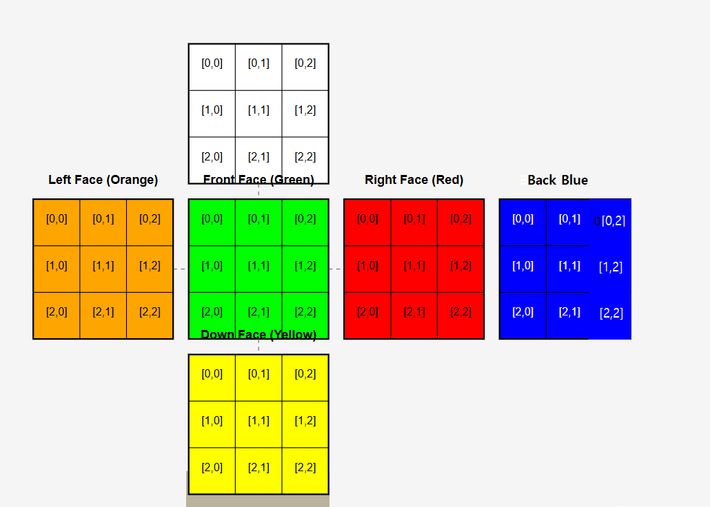
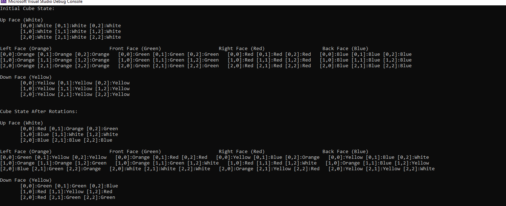

# Rubik's Cube Simulator

A console application that simulates a 3x3 Rubik's cube with the ability to perform standard face rotations.

## Features

- Accurate simulation of a 3x3 Rubik's cube
- Implementation of all standard face rotations (clockwise and counter-clockwise)
- Console-based visualization showing the state of the cube
- Proper edge and corner piece tracking during rotations
  
## How to Build and Run

### Prerequisites
- .NET 6.0 SDK or higher
- Windows PC

### Building the Application
1. Clone this repository
2. Open a command prompt in the project directory
3. Run `dotnet build`

### Running the Application
1. After building, run `dotnet run` in the project directory
2. The application will:
   - Display the initial solved cube state
   - Apply the rotation sequence: F R' U B' L D'
   - Display the final cube state after rotations
  ### Cube Coordinate System

The cube uses a coordinate system where each position on a face is identified by [row, column] coordinates:

*Figure 1: Coordinate system for each face of the cube*

### Output Example

The application produces an output showing the state of the cube after applying the specified rotations:

*Figure 2: Console output showing the solved cube and the cube after rotations*

## Testing

The application has been thoroughly tested using:

1. **Unit Tests**: A comprehensive suite of unit tests verifies the correctness of:
   - Individual face rotations (both clockwise and counter-clockwise)
   - Edge piece transfers between faces
   - Proper state maintenance through multiple rotations

2. **Verification Methods**:
   - Confirmed that applying a rotation followed by its inverse returns the cube to its original state
   - Validated that corner and edge pieces maintain their relationships during rotations
   - Compared the results of the specified rotation sequence (F R' U B' L D') with a reference implementation (https://rubiks-cube-solver.com/)

The testing approach ensures that the simulator accurately represents a physical Rubik's Cube in all aspects of its behavior.
